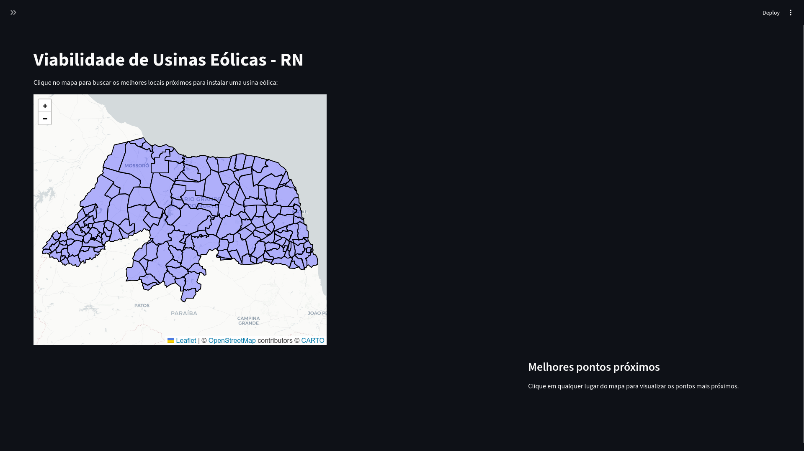
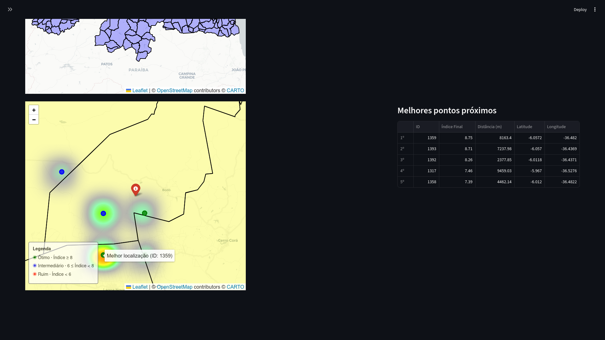
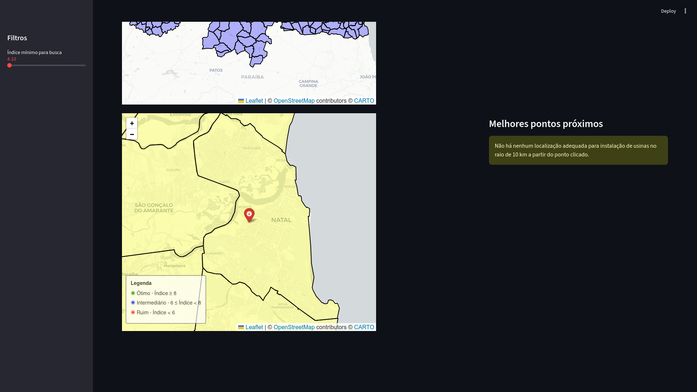

# Viabilidade de Usinas Eólicas - RN

**Disciplina:** Introdução à Inteligência Artificial
**Semestre:** 2025.2
**Professor:** ANDRE LUIS FONSECA FAUSTINO
**Turma:** T04

## Integrantes do Grupo

* Júlio César Carmo Maia(20210048800)
* Maria Rita Lopes Silva (20250033544)
* Maria Mariana Varela Cavalcanti Souto (20250033894)

## Descrição do Projeto

Este projeto consiste em um sistema de apoio à decisão para identificar e visualizar a viabilidade de instalação de usinas eólicas no estado do Rio Grande do Norte. A solução integra um agente de coleta de dados (`agente.py`) que consome a API da NASA POWER para obter métricas climáticas (vento e radiação solar) e cruza essas informações com dados geoespaciais locais, como declividade, uso do solo, áreas de conservação, redes elétricas e áreas urbanas.

O sistema utiliza um Modelo de Soma Ponderada (WSM) no script `calculo.py` para gerar um índice de viabilidade de 0 a 10 para cada célula do mapa. Os resultados podem ser visualizados de duas formas:

1. **Dashboard Interativo (`interface.py`):** Apresenta mapas de calor e busca visual.
2. **Método de Busca Analítico (`método_de_busca.ipynb`):** Um notebook Jupyter que permite a ordenação dos dados, listagem dos "Top N" melhores locais e busca detalhada por ID ou índice de corte.

## Guia de Instalação e Execução

### 1. Instalação das Dependências

Certifique-se de ter o **Python 3.x** instalado. Clone o repositório e instale as bibliotecas listadas no `requirements.txt`:

```bash
# Clone o repositório
git clone [https://github.com/julions27/viabilidade_eolica.git](https://github.com/julions27/viabilidade_eolica.git)

# Entre na pasta do projeto
cd viabilidade_eolica

# Instale as dependências
pip install -r requirements.txt
```


### 2. Como Executar

O projeto possui três modos principais de execução:

#### A. Interface Visual (Dashboard)

Para iniciar o mapa interativo em Streamlit:

**Bash**

```
streamlit run interface.py
```

O navegador abrirá automaticamente em `http://localhost:8501`.

#### B. Método de Busca (Análise de Dados)

Para realizar consultas específicas e visualizar rankings em formato de tabela:

1. Navegue até a pasta `Dados - método de busca`.
2. Abra o arquivo `método_de_busca.ipynb` utilizando Jupyter Notebook, Jupyter Lab ou Google Colab.
3. Execute as células para carregar o CSV de resultados e utilizar as funções de busca (`display_top_n_regions`, `search_region_by_id`, etc.).

#### C. Processamento de Dados (Backend)

Caso necessite reprocessar os dados brutos (nova coleta da NASA e recálculo dos índices), execute na seguinte ordem:

1. `python agente.py` (Coleta e processamento geoespacial)
2. `python calculo.py` (Cálculo dos índices e regras de veto)

## Estrutura dos Arquivos

A organização das pastas e arquivos principais é a seguinte:

* `interface.py`: Aplicação Frontend em Streamlit que gera o mapa interativo.
* `Dados - método de busca/`: Contém o notebook `método_de_busca.ipynb` para análise exploratória, ordenação e filtragem avançada dos resultados.
* `agente.py`: Agente de coleta que consulta a API da NASA e processa os shapefiles/rasters.
* `calculo.py`: Script de lógica que normaliza os dados, aplica os pesos (WSM) e gera o CSV final.
* `dados/`: Contém os datasets geoespaciais (Shapefiles `.shp`, GeoPackages `.gpkg` e Rasters `.tif`) do RN.
* `resultados/`: Pasta onde são salvos os arquivos CSV gerados (`resultados_finais_viabilidade_zonal.csv`).
* `requirements.txt`: Lista de dependências do projeto.

## Resultados e Demonstração

### Dashboard

A aplicação exibe um mapa interativo com:

* **Mapa de Calor:** Intensidade de viabilidade nas regiões aprovadas.
* **Filtros Dinâmicos:** Slider para ajustar o "Índice mínimo".
* **Busca por Proximidade:** Identificação dos 5 melhores pontos num raio de 10km do clique.

### Interface antes do clique

### Interface depois do clique

### Interface após clique em local sem nenhum resultado


### Análise via Notebook

O método de busca permite extrair insights como:

* Ranking das Top 10 regiões com maior índice.
* Filtragem de todas as regiões com índice > 9.0.
* Consulta detalhada dos motivos de veto ou aprovação de um ponto específico.

## Referências

* **[https://power.larc.nasa.gov/api/pages/?urls.primaryName=Monthly+%26+Annual#/Configuration%20Settings/configuration_settings_request_api_temporal_monthly_configuration_get](https://power.larc.nasa.gov/api/pages/?urls.primaryName=Monthly+%26+Annual#/Configuration%20Settings/configuration_settings_request_api_temporal_monthly_configuration_get)**: Fonte dos dados meteorológicos (Vento e Solar).
* [MapBiomas](https://mapbiomas.org/): Base para classificação e pontuação do uso do solo.
* **[https://www.ibge.gov.br/geociencias/organizacao-do-territorio/malhas-territoriais.html](https://www.ibge.gov.br/geociencias/organizacao-do-territorio/malhas-territoriais.html)**: Limites estaduais, áreas de conservação e infraestrutura elétrica do RN.
* **[https://dados.ons.org.br/](https://dados.ons.org.br/)**: Infraestrutura elétrica do RN
